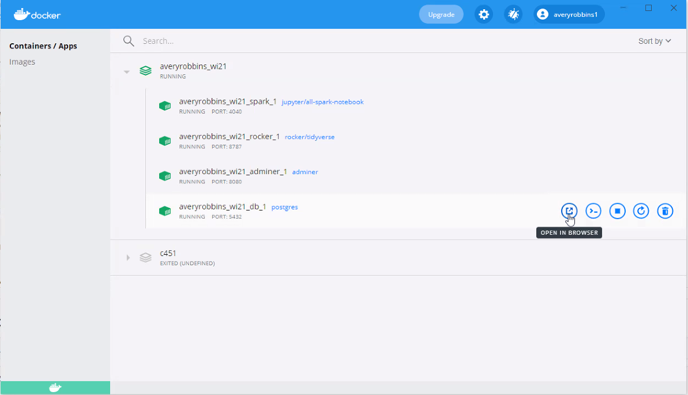

# rocker_guide

## In the beginning

Keaton and Avery spent hours and hours trying to get this stuff to work. We may be doofuses, but it took us a great deal of time, effort, and frustration to get R, sparklyr, spark, docker, etc. to work well together. We hope this repo saves you from the dark side. As for us, we are long gone.

There are many potential avenues to go down, like the [Spark from R book](https://github.com/jozefhajnala/sparkfromr_docker) or random images on [Docker Hub](https://hub.docker.com/r/datawookie/rstudio-sparklyr/). There are many dead ends because of a multitude of reasons:
 - There are many outdated images on Docker Hub
 - Some images on Docker Hub simply didn't work for us
 - Some images just have way to much installed and that can cause difficulties later on

## Its Docker images all the way down


We decided to build our own Dockerfile, pulling coding from other Dockerfiles that seemed to have parts of what we needed. When writing a new Dockerfile, you will rarely start from scratch. Start from a **base image**, which is generally from a verified publisher like RStudio.
Many images are built upon simpler images, for example:

- [Base R](https://hub.docker.com/r/rocker/r-ver/dockerfile)
- [RStudio](https://hub.docker.com/r/rocker/rstudio/dockerfile)
- [tidyverse](https://hub.docker.com/r/rocker/tidyverse/dockerfile)

## Following along with this guide

 ***Clone the repo:***
```
https://github.com/BYUI451/rocker_guide.git
```
We recommend storing the cloned repo in a directory adjacent to your existing cse451 project in order to simplify your path to the database.


## The Dockerfile

Below is the image that we built. It includes all the necessary linuxy stuff, R, the tidyverse, Java, sparklyr, Spark, and a few more packages.

```
# start with the most up-to-date tidyverse image as the base image
FROM rocker/tidyverse:latest

# install openjdk 8 (Java)
RUN apt-get update \
  && apt-get install -y openjdk-8-jdk

# install sparklyr

RUN install2.r --error --deps TRUE sparklyr

# install spark

RUN Rscript -e 'sparklyr::spark_install("3.0.0")'

# change location of spark directory

RUN mv /root/spark /opt/ && \
    chown -R rstudio:rstudio /opt/spark/ && \
    ln -s /opt/spark/ /home/rstudio/

# install a few more R packages for working with databases

RUN install2.r --error --deps TRUE DBI
RUN install2.r --error --deps TRUE RPostgres
RUN install2.r --error --deps TRUE dbplyr
```
## The docker-compose

After creating the Dockerfile, we need to add it to a docker-compose.yml with the postgres database and adminer. Notice that we connect the different containers via a network, `big_data`. The credentials for the database and RStudio should be stored in an `.env` file. The variable `MY_DB_PATH`, which should be the path to the database on your own machine, is also stored in the `.env` file. The `.env` file is included in `.gitignore`, so feel free to edit the `.env-template` that we have provided and change it to `.env`.

```
version: "3.8"

services:
  db:
    container_name: db
    image: postgres:13
    env_file:
      - .env
    volumes:
      - ${MY_DB_PATH}:/var/lib/postgresql/data
    ports:
      - "5432:5432"
    networks:
      - big_data

  rocker_sparklyr:
    build:
      context: .
      dockerfile: Dockerfile
    container_name: rocker_sparklyr
    depends_on: 
    - db
    ports:
      - "8787:8787"
    env_file:
      - .env
    volumes:
      - ./scripts:/home/rstudio/scripts
      - ./data:/home/rstudio/data
      - ./.Renviron:/home/rstudio/.Renviron
    networks:
      - big_data

  adminer:
    image: adminer
    container_name: adminer
    depends_on:
      - db
    ports:
      - '8080:8080'
    volumes:
      - ./scratch:/scratch
    networks:
      - big_data

networks:
  big_data:
```

## Installation and start up

**Major disclaimer:** we had a ton of trouble with this part. Sometimes everything would install great, and other times it would not work.


After a lot of weird bugs and failures, Avery did the following and it worked on his machine (Windows):

***Run the following command in the terminal*** (current working directory should be at the project level, where your docker-compose.yml file is located): 

```
docker-compose up
```

The above command may or may not work for you. If it does not work, we had success with the following experimental command, which is almost the same as the one above, just without the `-`.
```
docker compose up
```

Successful installation may take a few minutes. If that works for you, then be happy. Open up Docker Desktop and you should see the running network `rocker_guide`. If things did not work out for you, feel free to spend many hours like we did trying to debug. If you find a better solution, please submit a pull request. There are not enough good resources for this on the inter-webs.

## Connecting to the database

In `scripts` there is a script, `connect_to_database.R`, that will help you connect to the database. *Ahem*
Take the `.Renviron-template`, edit it appropriately, and store it as a `.Renviron` file in the project directory. `.Renviron` is also in the `.gitignore`. We use this file to store database credentials to be used with R. Below is the script.

```
# connect to database
# https://db.rstudio.com/databases/postgresql/
# https://github.com/r-dbi/RPostgres

con <- DBI::dbConnect(
  drv = RPostgres::Postgres(),
  dbname = Sys.getenv('POSTGRES_DB_NAME'),
  host = Sys.getenv('POSTGRES_HOST'),
  port = 5432,
  user = Sys.getenv('POSTGRES_USERNAME'),
  password = Sys.getenv('POSTGRES_PASSWORD')
)
```

## Connecting to Spark

Likewise you will find a `connect_to_spark.R` script in `scripts`. Use this to connect to Spark.

```
# connect to spark
# https://spark.rstudio.com/guides/connections/

sc <- sparklyr::spark_connect(master = 'local')
```

## Example

Check out our [example](https://github.com/BYUI451/rocker_guide/blob/main/scripts/example.R) script. It is a work in progress.

### Comment on our repeated failures

After successfully installing spark with sparklyr on our personal machine and many failed attempts to install it on Docker, we are convinced that Docker struggles to download the .tgz file.  Only twice has it successfully found and downloaded the spark file. When attempting to install spark with sparklyr through Docker, and if it fails, you will receive the following error:

```
Error in download.file(installInfo$packageRemotePath, destfile = installInfo$packageLocalPath,  :
download from 'https://archive.apache.org/dist/spark/spark-3.0.0/spark-3.0.0-bin-hadoop3.2.tgz' failed
```

### Potential with AWS

This stuff seems cool, but we didn't have time to dive deep:

- [Using Spark with AWS S3 buckets](https://spark.rstudio.com/guides/aws-s3/)
- [Running sparkylyr on Amazon EMR](https://aws.amazon.com/blogs/big-data/running-sparklyr-rstudios-r-interface-to-spark-on-amazon-emr/)


### Rocker in Japanese

[Go to repo](https://github.com/rocker-jp/tidyverse)


### Adding rocker container to n451 (no spark):

1. Go to your command line and run the following command to pull the existing rocker/tidyverse image from [docker hub](https://hub.docker.com/r/rocker/tidyverse): 

```
docker pull rocker/tidyverse
```

2. Copy the snippet below and paste it at the bottom of your existing docker-compose.yml file. If using VS Code, you may have to install the docker-compose.yml extension. The spacing and what not needs to be exactly right because it is a YAML file.

```yml
rocker:
    image: rocker/tidyverse
    environment: 
      - USER=rstudio
      - PASSWORD=rstudio1234
    depends_on: 
      - db
    ports: 
      - '8787:8787'
    volumes:
      - ./scripts:/home/rstudio/scripts
      - ./scratch:/home/rstudio/scratch
      - ./work:/home/rstudio/work
      - ./data:/home/rstudio/data
    networks: 
      - n451
```
(Will explain the above stuff later)


3. Run the following command in your terminal with your project directory as the working directory: 

```
docker-compose up
```

4. Either enter http://localhost:8787/ in the browser or go to your Docker Desktop app and open in the browser from there.


